

  

<h2><a href="http://ki.xyrs.bid/sy/">【预告】元宵节新唐人独家播出“神韵晚会”及“交响乐音乐会” </a></h2>

<h3><a href="http://ki.xyrs.bid/sy/">请大家告诉大家，并请先详细阅读下方的收视方法。 </a></h3> 

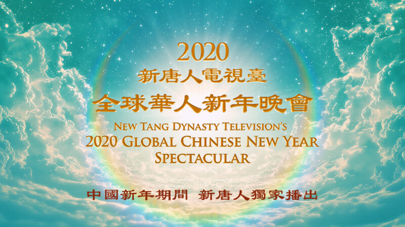
  

免翻观看预告片 http://ki.xyrs.bid/sy/

 
<h3><a href="http://36.227.96.182"> 免翻观看更多影片  http://36.227.96.182  </a></h3>

 
<h3><a href="http://ki.xyrs.bid/sy/">请大家告诉大家，错过可能得等一年！</a></h3> 

收藏此网址 https://git.io/diodio

<table>
<tr><td>
【新唐人北京时间2020年02月03日讯】2月7日（周五）是元宵节，新唐人电视台将独家播出“新唐人全球华人新年晚会——神韵晚会”，由神韵艺术团、神韵交响乐团、飞天艺术大学、飞天艺术学院联合演出。同时，新唐人还将播出“神韵艺术团交响乐团2018年音乐会”。

神韵晚会将在大陆、纽约、美西、欧洲等全球五个频道播放，对海外播出的是“神韵艺术团2019年演出”，对中国大陆播出的是“神韵艺术团2020年演出”。网站不播出，只限于电视收看。Roku平台不播出2020全球华人新年晚会，将播出2017和2018年神韵交响乐团音乐会。

五千年来，神传文化在中国溢彩流光。近代以来，这一人类的瑰宝几近失落。通过动人心魄的音乐与舞蹈，神韵令神传文化再现辉煌。神韵艺术团自2006年在全球巡演以来，迄今逾百万人观看，受到各国民众的热烈欢迎，爆满加坐成常态。

神韵交响乐是神韵原创的作品，以洪大的交响乐再现中华音乐传统，重现失传的美声唱法，由中国器乐领衔，搭配西方经典曲目，带给您前所未有的启迪，邀请您踏上五千年的音乐之旅。

亲爱的观众朋友们，让优质的中国古典舞及音乐盛宴陪您与家人共度元宵，敬请阖家观赏！

海外观众如要观看最新的〝神韵晚会〃，请到当地剧院买票观看，演出行程可以查询：http://www.shenyun.com
</td></tr>
</table>

  

  
  
<h2><a href="http://ki.xyrs.bid/sy/"> 大陆播出时间</h2></a>

  
  

  

  

  

  
 
<h3>对中国大陆播出的是“神韵艺术团2020年演出”。网站不播出，只限于电视收看。</h3> 

<a name=list-1>

<h3><a href="http://ku.xyrs.bid/sy/">中国大陆收视方法</h3></a>
 

<table>
<tr>
<td width=440><a href="#k1"><h3 align="center">◆通过爱博电视收看</a></h3></td>

<td width=440><a href="#k2"><h3 align="center">◆通过衛星《韩星五A号》收看</a></h3></td>
</tr>
</table>

<a name=k1>

<h3><a href="http://ku.xyrs.bid/sy/">中国大陆收视方法(一)</h3></a>
 

  

<h3 align="center"><a href="https://github.com/awwkk/usdom/blob/master/dong/Green_iPPOTV.exe?raw=true">◆ 可通过爱博电视收看新唐人中国频道，请选用中国频道400收看。◆ </h3</a>

	
<table>
<tr>
<td width="450"><a href="https://github.com/awwkk/usdom/blob/master/dong/Green_iPPOTV.exe?raw=true"><h5 align="center">爱博电视桌机版.下载  (完全免费 .安全. 无毒)</a></h4></td>

<td width="450"><a href="https://github.com/awwkk/usdom/blob/master/vidio/ippotvm.mp4?raw=true"><h5 align="center">爱博电视桌机板 (安裝教学).下载 </a></h4></td>
</tr>
</table>
   
  
 
  一款用于实时视频流共享的软件平台，高效稳定的视频传输技术带给用户崭新的视听体验。爱博电视具有突破封锁的得天独厚的优势。

  <a href=#list-1><h4 align="right">回上方</a></h4>
   

 

  

  
<a name=k2>
  
<h3><a href="http://uu.xyrs.bid/sy/">中国大陆收视方法(二)</h3></a>
 

<h3 align="center"><a href="http://uu.xyrs.bid/sy/">◆ 可通过韩星五A号的新唐人中国频道收看</a></h3>

  

<h3>韩星5A号的播出参数</h3>

<table>	
<tr>
<td width="450">
参数</td>

<td width="440">
数值 </td>

</tr>
	
<tr>
	<td width="450">
Frequency(频率)</td>

	<td width="440">
12618 MHz(或取整数) </td>

</tr>
<tr>
	<td>
Pol(极化)</td>

	<td>
V(垂直)</td>

</tr>
<tr>
	<td>
Symbol Rate(符率)</td>

	<td>
03900 ks/s</td>

</tr>
<tr>
	<td>
纠错率: (FEC)</td>

	<td>
-1/2</td>

</tr>
<tr>
	<td>
Video PID（视频）</td>

	<td>
0512</td>

</tr>
<tr>
	<td>
Audio PID（音频）</td>

	<td>
4112</td>

</tr>
<tr>
	<td>
Clock PID（时钟）</td>

	<td>
0512</td>

</tr>
</table>
 

<h3>韩星5A号</h3>

因为韩星5号卫星寿命到期，其播出已经由韩星5A号接替。卫星位置和参数不变, 卫星接收天线不需要作任何调整。预计东北地区信号会有所增强，内陆部分地区信号会有所减弱。

谘询电话001-800-558-9045或电邮至feedback@ntdtv.com。

新唐人电视台 2018年9月16日

  
 <a href=#list-1><h4 align="right">回上方</a></h4>
 
  

  

  

 

<a href="https://github.com/sodore/dsds/blob/master/fonts.md"><h3>◆ 翻墙软件下载 (完全免费 .安全. 无毒)</a></h3>

<table>
<tr>
	
<td width=440>
<a href="https://github.com/awwkk/usdom/blob/master/dong/20fg771zzz.zip?raw=true"><h4 align="center">(自由门)桌机版 20fg771zzz zip</a> </h4></td>
<td width=440>
<a href="https://github.com/awwkk/usdom/blob/master/dong/20-129fg771ppp.exe?raw=true"><h4 align="center">(自由门)桌机版 20-129fg771ppp exe</a> </h4></td>
</tr>
</table>

<table>
<tr>

<td width=440><a href="https://github.com/awwkk/usdom/blob/master/dong/fgma=3.2.apk?raw=true"><h4 align="center">(自由门)安卓版 3.2 apk</a></h4></td>
<td width=440><a href="https://github.com/awwkk/usdom/blob/master/dong/um=4.6.apk?raw=true"><h4 align="center">(无界)安卓版4.6 apk</a></h4></td>
</tr>
</table>

<table>
<tr>
<td width=440><a href="https://github.com/awwkk/usdom/blob/master/dong/u=19.02.zip?raw=true"><h4 align="center">(无界)桌机版 19.02 zip</a></h4></td>

<td width=440><a href="https://github.com/awwkk/usdom/blob/master/dong/u=19.02.exe?raw=true"><h4 align="center">(无界)桌机版 19.02 exe</a></h4></td>
</tr>
</table>

<table>
<tr>
<td width=440><a href="https://github.com/awwkk/usdom/blob/master/dong/Green_iPPOTV.exe?raw=true"><h4 align="center">(爱博电视)桌机版</a></h4></td>

<td width=440><a href="https://github.com/awwkk/usdom/blob/master/vidio/ippotvm.mp4?raw=true"><h4 align="center">爱博电视 (安裝教学)</a></h4></td>
</tr>
</table>

<a href=#list-1><h4 align="right">回上方</a></h4> 
 

 

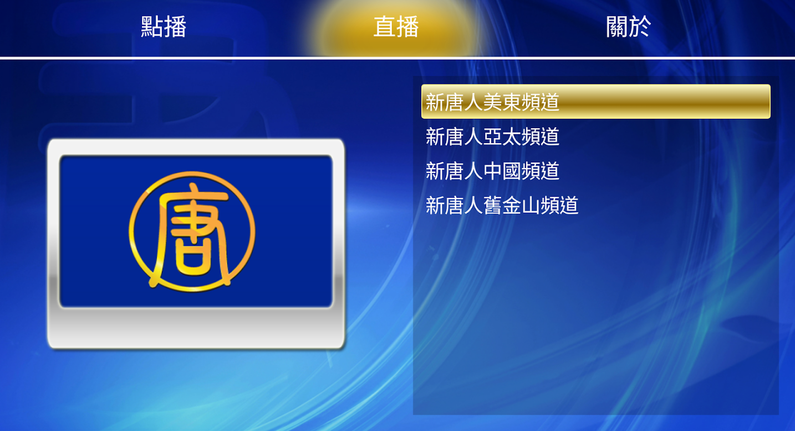
  

<a href="https://github.com/awwkk/usdom/blob/master/dong/iNTD_TVsp1.apk?raw=true"><h4 align="center">新唐人安卓版 iNTD TV 可以用于安卓机顶盒，平板电脑，和手机。在安装安卓版 iNTD TV 后，中国大陆用户无需借助翻墙工具，可以直接通过安卓版 iNTD TV 收看新唐人直播或点播节目。</a></h4>
<table>
<tr>
<td width=880><a href="https://github.com/awwkk/usdom/blob/master/dong/iNTD_TVsp1.apk?raw=true"><h4 align="center">新唐人电视 (安卓版).下载</a></h4></td>
</tr>
</table>
  

  

  
<a name=list>

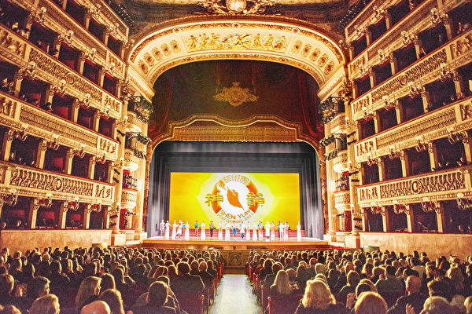
  

1月10日，美国神韵巡回艺术团在意大利那不勒斯的首场演出爆满。（Marius Iacob／大纪元）

<a href="#4">➤神韵那不勒斯首演爆满 欧洲贵族名流相约来</a>

	
	

  

2020年1月5日下午，魁北克省知名创作歌手、作曲家Bérard女士对神韵的女高音歌唱家深感敬佩，表示传统的内涵必须承传下去。 （新唐人电视台）

<a href="#5">➤神韵舞台散发慈悲能量 加国音乐名人泪流满面</a>

	
	

  

2020年1月3日晚，美国神韵国际艺术团在英国利物浦帝国剧院（Liverpool Empire Theatre）展开了今年在当地的第一场演出，现场爆满。（罗元／大纪元）

<a href="#6">➤“这是神的恩典” 神韵英国利物浦首场爆满</a>

	
		

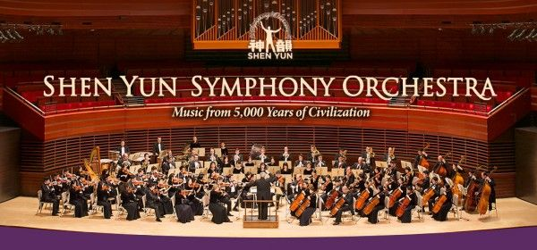
  

神韵交响乐团（神韵艺术团提供）

<a href="#2">➤“与宇宙相连”指挥家赞神韵交响乐宏大无比</a>

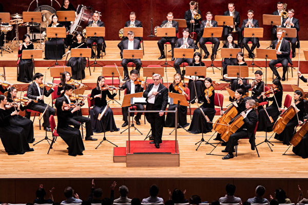
  

2019年9月23日午间，神韵交响乐团在台北国家音乐厅演出。（陈柏州／大纪元）

<a href="#1">➤知名乐评人：神进入神韵音乐 拯救人的灵魂</a>

<a href="https://youtu.be/1Oo4batsd7c">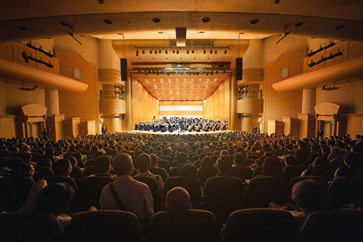</a>
  

2019年10月2日晚间，新竹市文化局演艺厅是神韵交响乐团2019年度在台湾的最后一场演出，演出出现爆满的盛况。（龚安妮／大纪元）

<a href="#3">➤11场连续大爆满 神韵交响乐台湾完美落幕</a>

  

<a href=#list><h4 align="right">回上方</a></h4>

 
<a name=6><h2>“这是神的恩典” 神韵英国利物浦首场爆满</h2>
 

  

2020年1月3日晚，美国神韵国际艺术团在英国利物浦帝国剧院（Liverpool Empire Theatre）展开了今年在当地的第一场演出，现场爆满。（罗元／大纪元）

【大纪元2020年01月04日讯】（大纪元记者麦蕾、肖悯英国利物浦报导）2020年1月3日晚，美国神韵国际艺术团在英国利物浦帝国剧院（Liverpool Empire Theatre）展开了今年在当地的第一场演出，现场爆满。

深厚博大的中国神传文明在西方的舞台上光彩四射，古老的中华道德、敬天信神的传统风貌让纯普的英格兰北部观众深深赞佩，演出结束时现场气氛非常热烈，很多人脸上洋溢着激动之色。

有的观众说，从来没见过帝国剧院像今天这样排着如此之长的入场队伍，“这是神的恩典。”

曾当过古典舞职业演员的英国女士Jackie Summers被神韵之美震撼落泪，“舞蹈演员都出类拔萃，远远超出我所学习和了解的古典舞，他们经过了扎实的传统训练，但水平又远远超出了传统训练，他们完全代表着舞蹈的超凡境界。”

<b>两家农场主观神韵 大赞技艺超群 道德高尚</b>

  

2020年1月3日，农场主Green（左二）夫妇跟Harrison夫妇一起于利物浦帝国剧院（Liverpool Empire Theatre）观看神韵演出。（麦蕾／大纪元）

约克郡的农场主Green夫妇跟Harrison夫妇观看神韵演出后赞叹，演员的技艺超群实属罕见。Matthew Green是农业公司的董事总经理，他的连襟David Harrison是约克郡另一家农场公司的老板。

Green夫妇同声称赞，演出“壮美优雅，非常壮观！”Harrison表示，第一次观赏中国古典舞，“对舞蹈的各种动作印象非常深刻，演员的技艺实力和他们的平衡感真是非凡。”

观看完演出，Green表示，感受到神韵节目道德高尚的精神内涵，让人积极向上，而且演员从舞台上散发出“非常正的能量”。Harrison也表示，演出令人体会到中国传统文化“与神性的联系”，这和英国人的信仰文化价值有共同的地方。

<b>英国主教夫妇观神韵：跟中国神传文化共鸣</b>

  

2020年1月3日晚，英国地区主教Andrew Golba和太太在利物浦帝国剧院观看神韵国际艺术团在当地的第一场演出。（麦蕾／大纪元）

来自英格兰北部的主教Andrew Golba和同是主教的太太Grace Golba赞叹神传文明的瑰丽。“演出非常赏心悦目，色彩缤纷绚丽，非常振奋人心。”

Golba说，在演出中看到了“自己跟中国文化的神性相连”。Golba从神韵故事中发现了中西方文化中微妙的文化联系。他认为，西方宗教中谈到的智者，其实来自于中国。

神韵女歌唱家的歌词让Golba感到震撼，他表示世界需要走回传统，不要相信无神论和进化论，因为“它们就是毒药”，“没有证据来证明进化论是正确的，那都是邪说。”

Andrew Golba是英国Doncaster地区的主教，也是Harvest Fields Distribution Limited的董事总经理。他的业务涉及英国、罗马尼亚，卢旺达，美国和欧洲其它国家。

<b>神韵给人超凡脱俗的视觉 创意总监获取灵感</b>

  

2020年1月3日晚，利物浦一家网络营销公司的创意总监Steve Smith先生跟家人观看了神韵演出。（麦蕾／大纪元）

Steve Smith在利物浦一家网络营销公司里担任创意总监，他称赞演出视觉呈现卓越不凡，并从出神入化的天幕设计中获得设计灵感。“演出的视觉效果、舞台背景、动态天幕都卓越不凡，非常出色。”

二胡演奏更是令他感到惊艳，“这是我第一次看二胡演奏，这种乐器如何与其它乐器合奏十分吸引我。我聆听时感受到心灵上跟这种庭院的联系。”

演出的神性内涵也令Smith印象深刻。“这是一个具备灵性内涵的演出。在视觉上令人感觉到创世主和神都一一呈现，非常好！”

<b>神韵令人陶醉 舞蹈公司老板看到高尚内涵</b>

  

2020年1月3日，共同拥有一家舞蹈和健身公司的Lane夫妇观看了神韵在利物浦的演出。（麦蕾／大纪元）

Louise Lane女士来源于一个专业舞蹈家庭，她和丈夫Darren Lane在欧洲阅秀无数，见识过很多一流的舞蹈演出。

然而Lane夫妇观看神韵后，才发觉各种艺术门类和舞蹈或多或少的受到了古老的中国古典舞的影响。“我们从中学习到，这一切都来源于中国古典舞。”Lane先生说。

Louise说，“他们配合得非常好，手臂造型和所有的细节都非常美！非常美，真是美不胜收！演出的艺术性真是超凡脱俗。”

“这是一个非常具有神性的演出。”Lane表示，“我们是信神的，能够理解演出呈现的内涵。”“这一切是无法打压下去的，因为这毕竟有古老的来源。”

<b>印度艺术基金会经理：这是神的恩典</b>

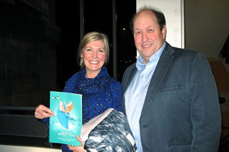
  

2020年1月3日，慈善机构经理Helen Kelly（左）和投资公司总裁Tony Webster（右）在利物浦帝国剧院观看神韵。（肖悯／大纪元）

Helen Kelly是英国最大印度艺术发展基金会的客户经理，她和朋友一同观看神韵后，不断称赞。Kelly说：“舞蹈家技艺卓绝，如此地美丽而奇妙。”

神韵艺术家是“真、善、忍”信仰的实践者，演出中由内而外表达出纯善纯美的信息，Kelly说：“这是绝对的，毫无疑问。从他们面部表情的流露、舞动的方式（都能看出）。”

回想起大幕拉开的印象，Kelly脱口而出：“是色彩！”朋友说：“那位圣人（身后光芒）的颜色真是令人惊叹，如此明亮，让人觉得好像自己都变亮了。”“太壮观了！”

当看到中国当局仍在残酷迫害善良人的信仰，Kelly说：“我认为这样的事情仍在中国发生真是令人沮丧，希望（迫害）会有所改变。”最后Kelly表示，看神韵对自己的工作也有所启发，她说：“这是（神的）恩典。”
如临仙境 震撼强烈 大陆留学生赞叹神韵

“（大幕一拉开）就感觉一下子看到仙境，好像自己就在天上，和他们一起跳舞。”刚来英国4个月、在英国读市场专业研究生的应女士赞叹道，“就看着看着好像就愣神了，就完全融入到这个表演中了。”

当看到舞台上神佛大显时，她的感受是“真的非常震撼”。“结尾那一幕和开头应该是呼应的，对吧？最终这些神仙还是回归到天上。我就觉得非常感动。”

谈到关于反映中国现实社会的节目，应女士说：“我觉得很多故事深刻的抨击了中国社会的现状，作为中国人，我看懂了。神韵把一些很复杂的故事用一些很让人理解的一种方式表达出来。我觉得这个是很难做的。”

应女士最后表示，会将观看韵演出的感受告诉国内的朋友家人，她还说作为中国人，神韵让她感到非常地骄傲，“我希望神韵不管是在英国还是在全世界，都发展得越来越好。”

责任编辑：夏晶

<a href=#list><h4 align="right">回上方</a></h4>

 
<a name=5><h2>神韵舞台散发慈悲能量 加国音乐名人泪流满面</h2>
 

  

2020年1月5日下午，魁北克省知名创作歌手、作曲家Bérard女士对神韵的女高音歌唱家深感敬佩，表示传统的内涵必须承传下去。 （新唐人电视台）

【大纪元2020年01月07日讯】（大纪元加拿大蒙特利尔记者站报导）2019年1月5日下午，神韵世界艺术团在加拿大蒙特利尔艺术中心（Place des Arts）Wilfrid-Pelletier剧院的最后一场演出成功落幕，给这座文化艺术名城的观众留下无限感动。著名音乐剧歌唱演员Judith Bérard女士观看演出后表示，对神韵复兴五千年神传文化的使命深感敬佩。

Judith Bérard说：“事实上，我认为神韵承载了极具勇气和教育意义的使命，特别是对生活在北美的我们来说，我们并不了解遥远的中国正在发生着什么。我们只能从媒体看到极为有限的信息。但神韵带来了久远的诗篇、美好的信息，这对我们西方人来说相当重要，至关重要。”

Judith Bérard是魁北克省知名创作歌手、作曲家、配音演员，1990年代～2000年代曾在法国、瑞士、比利时等地演出歌剧，并获得各种音乐奖项，她演唱的单曲也登上各种法语音乐榜。

Bérard认为，艺术是传递信息，消除伤害的最好方法。“这是神韵演出让我最感动的。艺术家用慈悲、美好和优雅的方式，反复传递我们需要了解的不同信息，超越一切媒体、政论和其它一切书面信息，通过充满启示的诗篇一样的舞蹈来表达。”

她说，“事实上让我非常感动的一点是演出让我们意识到，我们曾失去很多东西，我们曾在不知不觉中失去很多美好的事物。这是演出给我的提醒，我们不能忘记古老的传统，历史的诗篇必须承传下去。政权不应阻止或打压。”

Bérard被演出中反映法轮功修炼者故事的节目深深感动，“真正让我感动的是演出有勇气谴责伤害民众的暴力，而且用一种打动人心的旋律表达，还有因为当局打压信仰而不能在一起的那对情侣……这让我感到非常震撼。”她说，没有想到会被这种以音乐舞蹈演绎的故事深深感动。

Bérard表示非常喜欢神韵的原创音乐，“神韵的音乐广博经典，既有民族民间音乐，又有古老的中国传统音乐和西方交响乐，这是完美的组合。”

“我最感兴趣的是木鱼，既能带来古代禅意，又能带来幽默，非常有表现力，可以创造漫画般的气氛，非常奇妙，与舞蹈演员表现幽默的片段完美配合。”她补充道，“因此舞蹈和音乐的协调真是太完美了！”

身为歌唱演员的Bérard对神韵的女高音歌唱家深感敬佩，“女高音的演唱触及到我内心深处，歌唱家看起来娇小精致，非常优雅，却能发出具有惊人表现力和感染力的音色，”她赞叹道：“特别是最后的高音，极具震撼力，给我留下刻骨铭心的印象。我非常想知道是什么样的演唱方式，能达到这样充满力量的音色。”

Bérard还提到，自己多次被演出感动落泪，“单单是女士的柔美优雅就让我非常感动，这是在日常生活和传媒中再也找不到的恬静安详。”她说，“当我感到被舞台上散发出的慈悲能量包围着，我忍不住泪流满面。”

最后，Bérard女士希望神韵能长长久久地演下去。

责任编辑：颜永明#

<a href=#list><h4 align="right">回上方</a></h4>

 
<a name=4><h2>神韵那不勒斯首演爆满 欧洲贵族名流相约来</h2>
 

  

1月10日，美国神韵巡回艺术团在意大利那不勒斯的首场演出爆满。（Marius Iacob／大纪元）

【大纪元2020年01月11日讯】（大纪元记者麦蕾意大利那不勒斯报导）1月10日，意大利那不勒斯的观众盛装出席了神韵巡回艺术团在当地的首场演出。那不勒斯的富豪显贵、名门望族、政商名流纷纷慕名相约而来。

这是神韵第一次莅临那不勒斯，首次在久负盛名的圣卡洛剧院（Teatro di San Carlo）上演，该剧院列为世界遗产，是欧洲现存最古老的持续使用的歌剧院，也曾是当时世界上最大的歌剧院。

金碧辉煌的歌剧院内，神韵艺术家们通过优美的舞姿、动人的乐曲和生动的天幕，演绎着中国传统文化这曾经失落的世界遗产。见证了三百年荣辱心酸的古老欧洲舞台，终于等来了拥抱人类璀璨文化的机会。

<b>意大利公主： 神韵传递的信息非常重要</b>

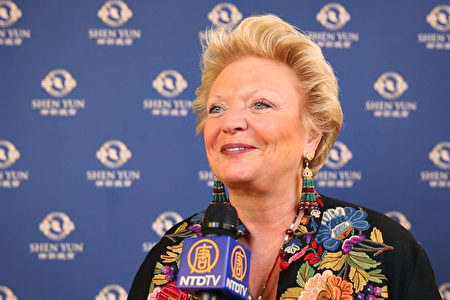
  

2020年1月10日晚，意大利王室公主Beatrice di Borbone-Due Sicilie 在那不勒斯圣卡洛剧院观看神韵演出。（新唐人电视台）

意大利王室公主Beatrice di Borbone-Due Sicilie 当天在圣卡洛剧院观看了神韵巡回艺术团的首场演出。 她赞叹说：“宏伟辉煌！缤纷的颜色，轻盈的舞动，太出色了。”

在美不胜收的舞蹈背后，她感受到一种深刻的精神信息，“有一种奇妙的力量！能感到他们想传达一个信息，这个信息非常重要。”她赞叹，“演出真的太美了！”

Beatrice di Borbone-Due Sicilie是法国波旁王朝在意大利分支两西西里王室的公主，当时欧洲最大的圣卡洛剧院就是波旁王朝两西西里国王统治时期建成的。

<b>二度看神韵 法国贵族后裔满怀感谢</b>

  

2020年1月10日晚，Bjorn De Decker和太太Isabelle De Decker从巴黎来到那不勒斯观看神韵演出。（麦蕾／大纪元）

Bjorn De Decker和太太Isabelle De Decker从法国巴黎二度观赏神韵，他们夫妇俩人对演出的经典之美赞赏有加。

Isabelle De Decker 女士和丈夫Bjorn De Decker经营跨国公司，他们来自法国贵族家庭，是比利时王族的亲戚，Bjorn De Decker还获颁骑士国家荣誉勋章（The Order of Leopold）。

De Decker夫妇一致向神韵舞蹈演员们表示祝贺，“恭喜神韵！”太太说。De Decker说，“祝贺你们，请把这么卓越的工作坚持下去！”

<b>意大利歌剧联合会主席夫妇赞：最高级的演出</b>

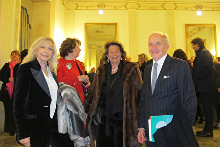
  

1月10日，意大利歌剧和交响乐全国联盟主席Daniela Traldi （左）当晚和先生Stefano Traldi（右）跟朋友一起观看了神韵演出。（麦蕾／大纪元）

意大利歌剧和交响乐全国联盟主席Daniela Traldi 当晚也和先生Stefano Traldi一同观赏了神韵巡回艺术团在当地的首场演出，他们都是意大利剧院的赞助者。

Daniela Traldi 对于神韵能在圣卡洛剧院演出表示极大欢欣，“我来到这里看演出，感到非常荣幸和高兴。”

Stefano Traldi赞赏，“演出非常美好、美不胜收，棒极了！”“这是最高级的，最好的演出。”

<b>圣卡洛剧院基金会董事：令人激动的演出</b>

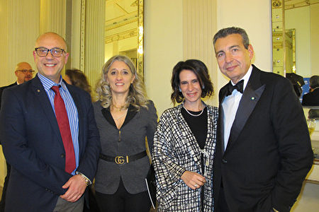
  

2020年1月10日，意大利那不勒斯市的副市长Luca Rotondi先生（左）和太太，与圣卡洛剧院基金会的董事会成员Mariano Bruni 先生和太太一同观看了神韵演出。（麦蕾／大纪元）

意大利那不勒斯市的副市长Luca Rotondi先生和太太，与圣卡洛剧院基金会的董事会成员Mariano Bruni 先生和太太一同观看了演出。他们表示神韵演出是受到了神的启发。

Bruni 说：“最打动我的是演出美丽动人的色彩，这是一个令人激动的演出，韵律非常快，同时舞姿又非常优雅。”

Rotondi盛赞道，“演出具有非常强大的神性，这是一种对信仰的呼唤，中华传统文化是一个更注重灵性，而不是专注物质的文化，总之整个神韵演出的形式真是美不胜收！”

<b>著名富豪赞佩神韵 复兴传统  展普世价值</b>

  

2020年1月10日晚，那不勒斯当地富豪、资深理财顾问Maurizio Stocchetti和友人，观赏了神韵巡回艺术团在那不勒斯圣卡洛剧院（NAPLES Teatro di San Carlo）的首场演出。（麦蕾／大纪元）

“美妙绝伦的演出，引人入胜，为我们意大利人打开了一扇了解中华传统文化的窗口。” 当地富豪、文化遗产保护机构的总裁Maurizio Stocchetti 表示，观赏神韵就是“跨越五千年的时空之旅”。

Stocchetti非常钦佩神韵艺术家复兴传统文化的努力，“在欧洲，我们正在经历同样的问题，技术高速发展，但也必须与保护千年传统文化保持平衡。神韵复兴传统文化、回归普世价值，这些都很容易领会、让人感同身受。”

<b>知名艺术家赞叹神韵 感受美妙未知领域</b>

  

2020年1月10日晚，意大利知名艺术家 Maria Gabriella Amitrano 在拿坡里圣卡洛剧院观看神韵巡回艺术团在当地的首场演出。（麦蕾／大纪元）

“ 绚丽美妙的色彩，这是我第一次欣赏到这样的舞蹈。” Amitrano 女士藏不住脸颊上的惊喜之情，Maria Gabriella Amitrano 是意大利知名艺术家，是众多文艺聚会场上的名流。

虽是第一次观赏中国古典舞， Amitrano 惊叹那与众不同却温婉柔美，“最美丽的就是，那些舞姿和我们的芭蕾完全不同，演出中的是非常美妙的，非常轻柔的舞姿，我真是非常喜爱。”

<b>意大利艺术教授：神韵降福于世人 唤醒返本归真</b>

  

2020年1月10日晚，意大利服装设计师兼艺术治疗师、那不勒斯大学艺术教授Patrizia Mauro于那不勒斯圣卡洛剧院观看神韵演出。（麦蕾／大纪元）

看完神韵演出，意大利艺术教授、服装设计师兼艺术治疗师Patrizia Mauro感动万分，她不断双手合十的表示，“这是一个让人返本归真的邀请”，“看神韵是一种福分”，“每个人都在被唤醒……”。

Patrizia Mauro眼含泪光的说着，“当神韵把慈爱融入到艺术中来表达（内涵），那是真正纯净的艺术，神韵所做的，就是一个在全球疗愈人类（疾病）的过程，太好了，感谢神韵！”

“这场整个演出，蕴涵着一种恩典世人的福泽，那是神之手在帮助世人，因为每个人都在被唤醒……”Patrizia Mauro表示，能制作出这么超凡脱俗节目的神韵艺术总监拥有“伟大的胸怀”，他是“一个神”，绝非凡人。

<b>时尚专家惊艳：观众得到升华</b>

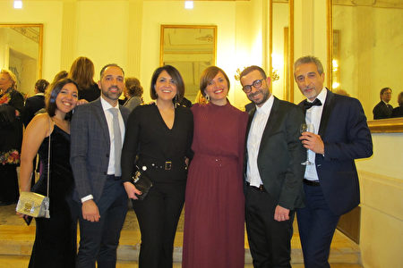
  

1月10日晚，意大利那不勒斯莫达学院(Accademia della Moda)院长Giuseppina Auricchio（右三）欣赏了神韵巡回艺术团在那不勒斯圣卡洛剧院的首场演出。（麦蕾／大纪元）

“神韵色彩突破视觉感受！”1月10日晚间，意大利那不勒斯莫达学院(Accademia della Moda)的院长Giuseppina Auricchio和同事欣赏了神韵在那不勒斯的首场演出后，惊喜赞叹。

Auricchio表示，神韵服饰与众不同，让她大为惊艳。她感受到这些完美的艺术背后有更深的内涵，“演出结束后，观众得到了升华，舞蹈演员们似乎在身体上甚至精神上也都得到了提升。”

当得知舞台上的艺术家们修炼法轮大法，日常中处处以真、善、忍的为行为准则时，她满心敬佩，“绝对感受到这一点，我要祝贺他们。”

责任编辑：曾晏均

<a href=#list><h4 align="right">回上方</a></h4>

 
<a name=1><h2>知名乐评人：神进入神韵音乐 拯救人的灵魂</h2>
 

  

2019年9月23日午间，神韵交响乐团在台北国家音乐厅演出。（陈柏州／大纪元）

【大纪元2019年09月24日讯】（大纪元台湾台北记者站报导）9月23日下午，享誉全球的神韵交响乐团来到台北国家音乐厅，为大台北政商、企业、艺文等各界名流带来温馨丰美的午后时光。神韵美妙乐音让满场观众为之陶醉，二首安可曲更将全场气氛带到最高点，观众起立鼓掌，欲罢不能。

知名音乐家、乐评人徐家元首度现场聆赏神韵交响乐，他盛赞：“这是我在台湾听过最好的乐团，觉得非常感动。”他同时感受到音乐中强大的神性力量，“就好像神活在我们人间的感觉。”

徐家元表示，神韵交响乐团水准很高，“有好的编曲，而且有国际级的音乐家，最好的指挥，然后他们的合奏能力很强，独奏家演奏得非常好，整体的气质很好，感染力很强。”

神韵交响乐的原创乐曲，根植于五千年文明，是神韵音乐获得巨大回响的关键因素。徐家元说，“原创的旋律很美，作曲家编曲，呈现出有东方味的西方交响曲，听了会让人很感动。”

“编曲把交响乐团的配器，乐器的特性表现得很好。”他说，“整个音乐轮转都很顺，再加上有各种民族乐器，二胡、琵琶跟锣鼓，气势很雄壮，婉转的时候很优雅，所以很感人，扣人心弦。”

徐家元特别赞赏指挥米兰‧纳契夫，“非常棒，炉火纯青，又有幽默感，他指挥得非常好，能带动整个乐团，把大家的心都聚在一起，很整齐划一。他的指挥动作非常潇洒，尤其是最后结尾那种感觉，会让你觉得很英俊潇洒。”

神韵交响乐团历年演出的CD早已广受爱乐人士喜爱，“我听过很多次录音，但是看现场觉得特别感动，现场的感动力是超过听录音的。”徐家元说。

<b>神进入神韵音乐 拯救人的灵魂</b>

徐家元也感受到，神韵动人的乐音中，具有强大的神性内涵，让他体悟到，“这个音乐是从信仰来的，作曲家的灵感来自于神性，神韵音乐的美，就好像神活在我们人间的感觉。”

他谈到更深一层的体会，“神有各种像会在人面前呈现，音乐就是一个像，神进入这个神韵音乐，让你感动，经由作曲家的作品，把神韵音乐创造出来。”

他说，在神韵音乐中，“我听到一种善良的心，就是一种同情心（慈悲心），对所有的生灵，在这个地球上，我感觉到这个。”

他并强调，“因为音乐是融合的，她（神韵音乐）有一种跟宇宙谐和的感觉，让我们人性跟神性能够合在一起，她带领人提升，还可以拯救人的灵魂。”

“因为这个音乐已经将东西方融合在一起了，所以我认为这音乐是对全世界的人都有感应的，也就是说，不分民族不分肤色，都可以感受到这个音乐（内涵）。”徐家元说。

<b>音乐家是真理的传递者 内外皆美</b>

徐家元提到，神韵音乐能感动人，除了音乐家本身高超的音乐素养和技巧，他认为和音乐家的修为也有关系。“所有的音乐家都是真理的传递者，我们（观众）是接受者。”

“他们的仪态都非常的好，走出来那种神态都特别好，外表也很美，内心也很美，所以是蛮特别的一个乐团，给人观感很好。”

他说，“那么多的国际音乐家他们都能够融入这个音乐，他们吹这个音乐的旋律都能够互相学习、互相映照，指挥可以把它都统合在一起，我认为他们大家有共同的信仰，才能做到这一点。”

<b>从微缩世界 看到宇宙之大</b>

神韵交响乐团今年巡演最新的原创曲目《康熙大帝》，让徐家元感受深刻，“这个曲子的结构比较大，她里面的旋律有很多是有一种中华民族满汉蒙回藏的音乐，还有宫廷音乐，不过因为她还有马背上的民族的味道，有北方游牧民族的味道。”

“当他进了中国、进了中原以后，她就有那种宫廷的味道，气势很庞大，就是有一种民族融合的感觉，还有版图很大的盛世的感觉。”

他说，这首曲子把康熙皇朝那个盛世完全展现出来了，“她的民谣素材取的很好，音乐是东方的感觉，东方音乐有她的文化底蕴，但是康熙那时候他已经有受到西方传教士的影响，所以也展现出东西融合的境界。”

徐家元最后推荐大家：“听过神韵的名字的人，应该来现场听这交响乐，一定要来现场听，她没有舞蹈也没有戏剧，就是要来听现场。”

他说：“台上交响乐是一个微缩的世界，但可以让你感觉到这个宇宙之大，所以没有来听过的，很推荐你一定要来听，你听了就会感动。”

责任编辑：于嫚

<a href=#list><h4 align="right">回上方</a></h4>

 
<a name=2><h2>“与宇宙相连”指挥家赞神韵交响乐宏大无比</h2>
 

 

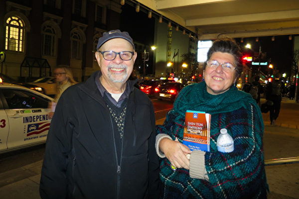

  
指挥家Arthur Comegno与友人Kathleen（护士）于10月25日晚，在波士顿交响乐厅，聆听了神韵交响乐团的音乐演奏会。（甄秀欣／大纪元）

 
  
【大纪元2019年10月26日讯】（大纪元记者甄秀欣美国波士顿报导）“神韵交响乐团宏大无比。”指挥家Arthur Comegno盛赞神韵交响乐团的音乐“神奇美妙”，他表示自己也想加入其中，共享音乐中的神性内涵。

神韵交响乐团于10月25日晚，在波士顿交响乐厅（Boston Symphony Hall）拉开了当地演出的序幕。指挥家Arthur Comegno与友人Kathleen当晚观看后非常的兴奋，他们在惊叹之余频频赞叹，Comegno说：“我觉得感受到内心的震撼，这是发自内心深处的感动。”

他感到神韵音乐具有神圣的启迪与宇宙相关，他认为，“音乐是有共性的”，在听到某些乐句时，Comegno有着独特的体验，“他们好像飞到了云端、飞向了神。特别是用弦乐器的比萨卡托（pizzicato，用指弹的拨奏曲），好似在战车上俯视战马，冲向天空。”他说，“有很多的爱和情感，我试图描绘——将每个曲目中的每个段落整合起来，太优美了！”

“我看到了神韵音乐与宇宙的相连，表现了爱、神性所有这些事情，我看到他们之间的连接。”他认为神韵交响乐团诠释了“一个非常好的理念”，“我希望回来再听一遍。”

Comegno有着丰富的指挥经验，指挥过许多大型音乐会，同时，他还做过专业小提琴手，培训过许多音乐人；他也是一名演员、导演，毕业于伊士曼音乐学院和哈佛大学。他从神韵音乐中看到了“西方音乐与亚洲音乐、中国音乐的结合”。他表示，“我也曾学过中国琴。我知道一些关于中国音乐的东西。”

他认为神韵交响乐团东西方合璧让整场音乐会中的乐声更加“美妙动听”，他觉得神韵“非常宏大”。“作为一个音乐家，我非常密切地看着交响乐团，数着七个低音演奏家、十个大提琴、十四个第一小提琴、十四个二级小提琴、中提琴，有趣的是，指挥有一个中提琴谱架，第一中提琴手的谱架。” Comegno娓娓道来。

“打击乐做了所有这些奇妙的事情，还有特殊的中国乐器。”他说，“我能说的最好的事情是：这是一场精彩的音乐会，我很惊讶和不知所措，所以我很高兴我来了。”

他赞叹神韵演奏家的技艺非凡，“哦，他们太棒了！我真的很喜欢他们。”

Kathleen也赞佩道：“神性贯穿在整个交响乐团，你能感觉到她。她美丽，令人沉思、反省，以及充满了能量活力。这是探索中国文化的另一部分。所以我很高兴我们今晚来了。”

责任编辑：夏晶

<a href=#list><h4 align="right">回上方</a></h4>

 
<a name=3><h2>“11场连续大爆满 神韵交响乐台湾完美落幕</h2>
 

  

2019年10月2日晚间，新竹市文化局演艺厅是神韵交响乐团2019年度在台湾的最后一场演出，演出出现爆满的盛况。（龚安妮／大纪元）

 

【大纪元2019年10月03日讯】（大纪元台湾新竹记者站报导）“安可、安可、安可、安可”全场观众有节奏性的鼓掌、呼喊，希望能再听一曲！2019年神韵交响乐团在台湾巡回演出的最后一站来到新竹市文化局演艺厅，演出结束后，观众起立鼓掌致敬，在两首安可曲后，全场观众仍意犹未尽，持续喊着“安可”、“Encore！”长达近10分钟的掌声，让全场气氛沸腾到最高点，最后艺术家们两次谢幕向观众致意，也为神韵交响乐团的压轴演出划下完美的句点。观众都说：“手都拍到好痛，但真的好好听、好过瘾！” 

今年是神韵交响乐团第四年在台湾巡回演出，在九大城市巡回11场演出，全台的售票率几乎百分百，再度创下场场大爆满的票房纪录！再次创下台湾艺文界票房奇迹，有知名艺文团体私下透过管道询问，“神韵到底是怎么办到的？”

神韵交响乐热在台湾持续发烧，最后一场更有许多观众不断致电主办方询问购票，主办方表示，“观众知道神韵交响乐的每张票都很珍贵，真的是一票难求了！”还有粉丝特地从高雄北上、台北南下，甚至远从印尼、香港、大陆等地慕名前来的观众也不在少数。散场时，观众各个笑开怀、赞不绝口，纷纷表示：“太精彩了！明年还要再来！”

 

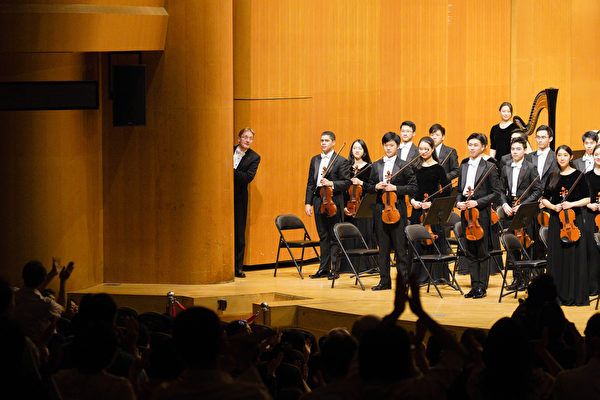

 
2019年10月2日晚间，神韵交响乐团在新竹市文化局演艺厅举行2019年度在台湾的最后一场演出，观众欢声雷动的掌声与安可声，让指挥迪密萃‧鲁苏偷瞄一下观众有多热情，逗得观众掌声更加热烈。（龚安妮／大纪元）

10月2日晚间，众多各地名流精英纷纷赶在最后一天入场观赏神韵交响乐，新竹县长杨文科、新竹市长林智坚、新竹市议会议长许修睿特致赠花篮祝贺演出成功。神韵音乐家高超卓越的艺术造诣，让走出剧院的精英们赞赏“犹如天籁之音”、“感受到天人合一的境界”、“有被宇宙拥抱的感觉”。

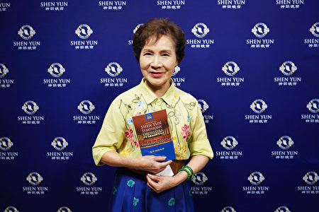

 
2019年10月2日晚间，前立法委员张蔡美观赏神韵交响乐团在新竹市文化局演艺厅的演出。（龚安妮／大纪元）

“今天总算圆梦了！”前立法委员张蔡美说，“已经向往这个演出三年了，这次运气好，总算可以观赏这个温馨又震撼的演出。”她说，一进神韵的会场就感觉很不一样，“从头到尾，我的情绪几乎跟着音符一起浮动。”她笑着指着她的脸，“我脸上这个光圈就是神韵团队带给我的。”

神韵交响乐东西乐器合璧的乐音也让张蔡美非常惊艳，“我也很惊讶很惊艳的一些事情，能够这样融合，真的很不容易，我觉得是创造者真的值得我们去敬佩。”她说，今晚的音乐会让她“满心喜悦”。

 
2019年10月2日晚间，立法委员林为洲观赏神韵交响乐团在新竹市文化局演艺厅的演出。（龚安妮／大纪元）

“今天可以静下心来听，真的很享受。”立法委员林为洲陶醉在神韵音乐中，静静地感受着玄妙能量，他赞赏神韵音乐是“天籁之音，非常悦耳，是全新的听觉飨宴”。

“我们从政者每天在立法院都是很紧绷、很紧张的，有时候甚至会有冲突。”他说，每天在这种生活之下，能有此机缘聆赏神韵音乐，“真的好像天籁之音一样，调剂我的身心。”

他赞叹道，神韵音乐能量很强，可以洗涤心灵，“音乐会净化人心，短暂休息之后可以重新面对自己，然后去思索很多内在的事情。”

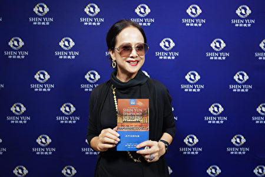

 
2019年10月2日晚间，艺人汤兰花观赏神韵交响乐团在新竹市文化局演艺厅的演出。（龚安妮／大纪元）

“我真的非常感动，（神韵音乐）从编曲到演奏的方式，都充满感情与东方的味道。”知名艺人汤兰花赞赏，“中国几千年的文化，通过音乐展现出来，这真的是美的飨宴，太棒了！”

汤兰花盛赞神韵让她领悟音乐的震撼，并带她进入一个新的层次，“她（神韵）让人提升到一个想听，能看到画面的层次，我感觉自己一直在提升。”眼睛刚动过手术的汤兰花说，她闭着眼睛仔细聆听，让她领悟音乐的震撼，并带她进入一个新的层次。

“神韵的水准真的很高。”她说，演出让她对音乐的感受度往上升华，这是一次相当美妙的学习经历，“我静静地听，好像看见了鸟儿在丛林里飞翔，好像看见一位穿着古装的古典美女，在树林里飘渺地出现。”

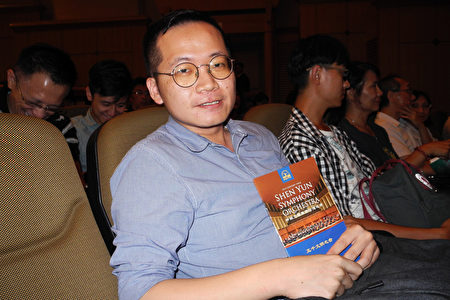

 
2019年10月2日晚间，知名音乐家、乐评人吴毓庭观赏神韵交响乐团在新竹市文化局演艺厅的演出。（龙芳／大纪元）

“这个乐团基本上有一种很明亮的感觉。”音乐家、知名乐评人吴毓庭赞赏神韵交响乐团，“无论是音色的选择或者力度的选择，都很有自信，很明亮。”他觉得，“神韵的特色来源于自信，给人很愉悦的感觉。”

神韵交响乐团今年巡演最新的原创曲目《康熙大帝》，让许多观众感动，吴毓庭则感受到一种力量，“一种不断一直堆叠的力量，然后所有的音乐家都是全神贯注，感觉他们已经到顶点，但是他们还可以再往前、往上推上去，还可以继续延伸、继续酝酿。”

他表示从中可以感受到这个团队背后的精神力量，“他们的意志力是很强的，他的精神是无限的。”他说，“这首让我感觉他们内心有无限的潜力，在这个音乐当中，他们也透过这个演出，发挥自己心里面的一种力量。”

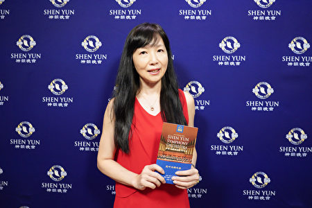

 
2019年10月2日晚间，风雅颂古筝乐团团长徐惠绮观赏神韵交响乐团在新竹市文化局演艺厅的演出。（龚安妮／大纪元）

“神韵像神仙的音乐一样，让我忘忧。”台湾知名的古筝演奏家、古筝乐团团长徐惠绮二度聆听神韵交响乐团赞赏，“我在神韵看到的一种精神吧！就是传递音乐，就算是听不懂、没有学过音乐的，不管是长者或者是年轻的小朋友。”她赞佩地说：“就是能够让大人、小孩听了都这么感动，这一点值得我们学习，能够让音乐做到这样的层次。”

她说，“我每次坐在台下听完之后，我觉得身心舒畅，全身非常的舒畅，就像人家讲的‘音乐丰富我们的心灵’，神韵真的让我有这种非常强烈的感觉。”

“在神韵台湾巡演九大城巿11场的演出中，今天最后一场我看到了，我觉得我很荣幸。”徐惠绮最后开心地说。

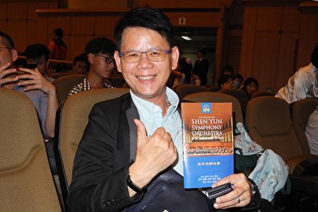

 
2019年10月2日晚间，国际生命线台湾总会副总会长、公司董事长陈宗圣观赏神韵交响乐团在新竹市文化局演艺厅的演出。（龙芳／大纪元）

“音乐充满生命力！”环保公司董事长、同时担任国际生命线台湾总会副总会长的陈宗圣说，“神韵不只是音乐，她还有很强的表现力和感染力！”整晚徜徉在曼妙旋律中，对神韵音乐创造出来的丰富意境，万分珍惜地使尽耳目感官所能去品味，他开心地笑说，“亮点很多，我今晚好忙啊！”

整场音乐会的压卷之作《康熙大帝》，令他深深折服，“我听到的是一种盛世，从争战的沙场到光荣凯旋，然后创造了一个人民祥和的局面，然后是一个非常‘盛世’ 的朝代，让人感受到那种（精神上的）振奋。” 他感动地说。

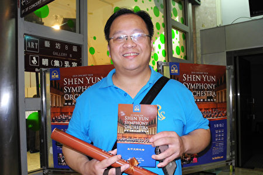

 
2019年10月2日晚间，建设公司执行长魏木忠观赏神韵交响乐团在新竹市文化局演艺厅的演出。（龙芳／大纪元）

 
 “神韵交响乐是中西合璧的天地音乐！”建设公司执行长魏木忠赞赏，“从至刚至柔的音乐中，我感受到天地交泰，天人合一的境界。”

“神之乐，神之韵，这一定是来自天上！”魏木忠以为，神韵乐章非等闲之作，不是人类的精心创制，这得天地共谱，人们经由神之启示，再由音乐家的虔心发想而成。

魏木忠表示，聆听神韵交响乐，是一段很特别的、难以形容的爱的体验过程，“在神韵音乐里，她有太多宇宙美好的元素，我感受到一种振奋、一种洗涤、一种启示，就在我们的内心涌动。”

“神韵交响乐是至刚、至柔的一种音乐，在这二者之间，撞击出的能量跟磁场，会让你看到那个善跟美的画面。”魏木忠说，“你所看到的那个景象，让你从一颗心、从一个念都感到很舒服，仿佛被拥抱——被我们这个宇宙（拥抱）。而我们，已然就此融合在一起了！”

 
 

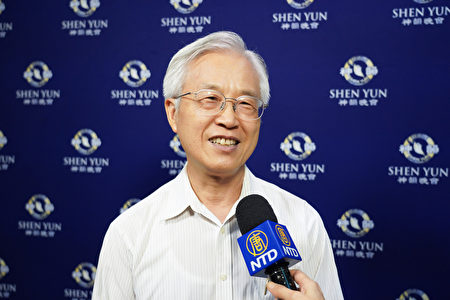

 
2019年10月2日晚间，生物科技公司董事长陈良荣观赏神韵交响乐团在新竹市文化局演艺厅的演出。（龚安妮／大纪元）

 
 生物科技公司董事长陈良荣首次观赏神韵交响乐的演出，“真的很震撼，东西方乐器融合在一起，配得非常的完美，而且非常雄伟，尤其最后一首《康熙大帝》，非常澎湃，很壮观。”

陈良荣非常佩服作曲家，“作曲做得非常好，把中西这个乐器很顺地交融在一起，这是不容易的。”他希望没有听过神韵交响乐的朋友不要错过，“会让你觉得东方的美学跟西方的美学交融在一起，迸出来的火花，令人印象深刻。”

 
 

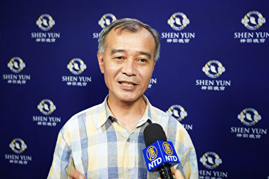

 
2019年10月2日晚间，新竹县建筑师公会理事长林清恕观赏神韵交响乐团在新竹市文化局演艺厅的演出。（龚安妮／大纪元）

 
 “非常厉害，那个作曲家真的很厉害！”新竹县建筑师公会理事长林清恕说，一般的交响乐都是西方乐器，可是神韵交响乐可以把西方、东西的乐器融合，“结合得那种妙，可以说是无缝接轨。”他赞叹地说，神韵音乐可以表现康熙皇朝的磅礴气势，“那种盛世的画面，感觉我就坐在皇宫里”，又可以表现《彝舞倩妹》那种在山林里跳舞的画面，“整个曲风完全是传统的中国味，编曲真是厉害！”

“太完美了！”林清恕说，平常大家都忙，很少有休闲娱乐，聆赏神韵交响乐让他很重拾传统文化的美好记忆，“传统的文化，这个社会已经好像很久没有感受到这种东西，尤其这个时代已经不一样，以前我们的教育是比较接受到传统的历史文化，现在社会好像很少，这方面越来越弱了。这乐音会让人怀念那些传统的文化。”

 
  

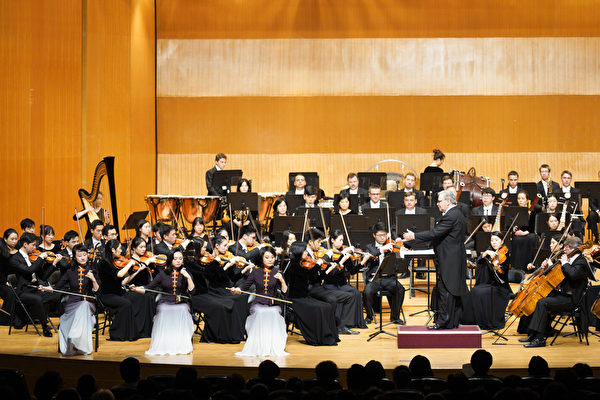

 
2019年10月2日晚间，神韵交响乐团在新竹市文化局演艺厅演出，前排为二胡演奏家戚晓春（左）、王真（中）、琴露（右）。（龚安妮／大纪元）

 

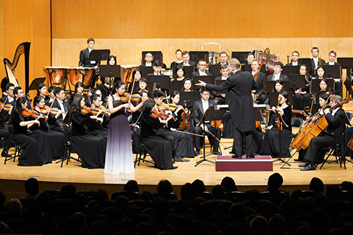

 
2019年10月2日晚间，神韵交响乐团在新竹市文化局演艺厅演出，图为小提琴独奏家郑媛慧。（龚安妮／大纪元）

 

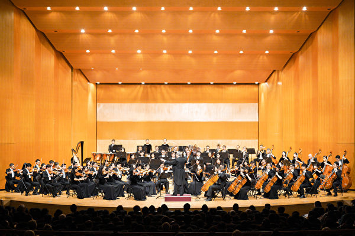

 
2019年10月2日晚间，神韵交响乐团在新竹市文化局演艺厅演出。（龚安妮／大纪元）

 
 

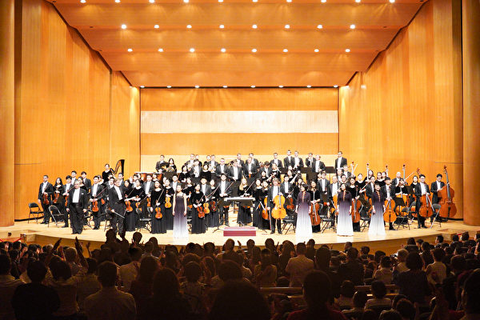

 
2019年10月2日晚间，神韵交响乐团在新竹市文化局演艺厅演出的谢幕。（龚安妮／大纪元）

 
 责任编辑：夏晶 #

 
 
 

 

  

